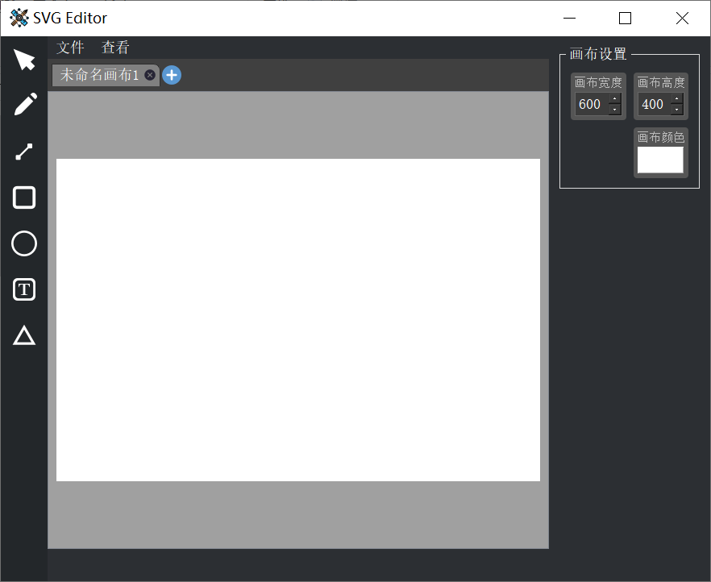

# Drawing-Tool
Analogous to another project [inferiorStudent/rich-text-with-AI-helper: built by C++ Qt5 (github.com)](https://github.com/inferiorStudent/rich-text-with-AI-helper), the drawing tool (also called svg editor) **is built in the same way**. I prefer this project for its practicality, extensibility and clear structure.

## 1 Outline

## 2 Performance

- Multi-canvas manager
- Export as svg, png and jpeg
- More importantly, the text box is developed with only **event rewriting** instead of `QLineEdit` or other Qt native components.

## 3 Conclusion

Despite there exist so many bugs...
